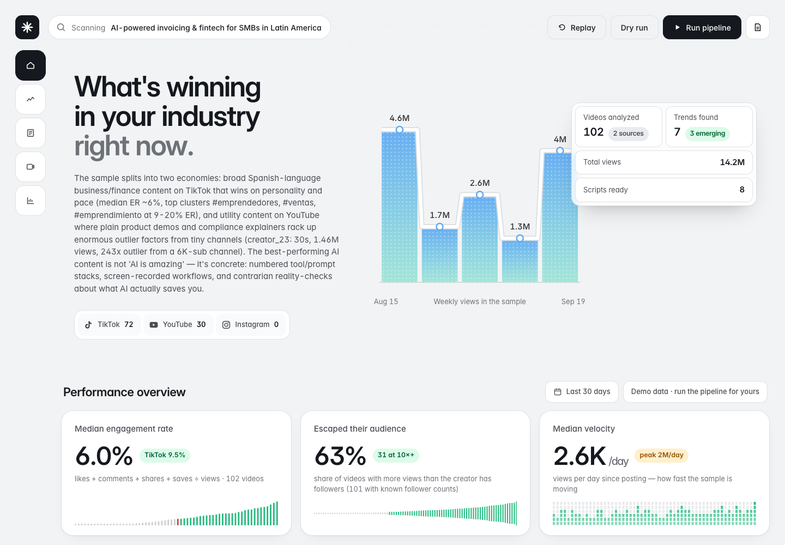
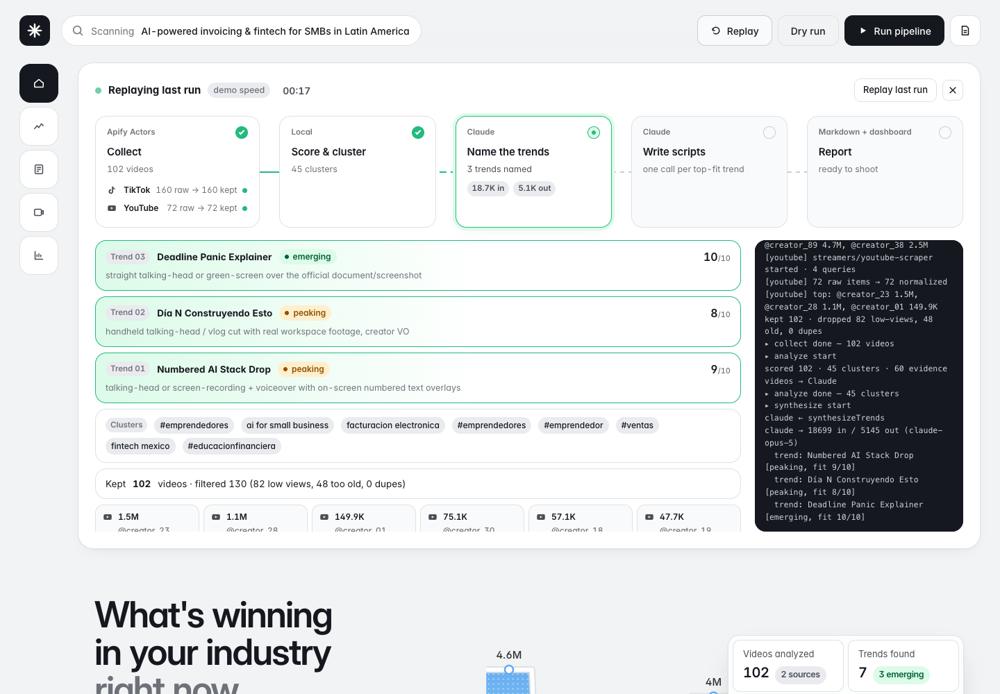
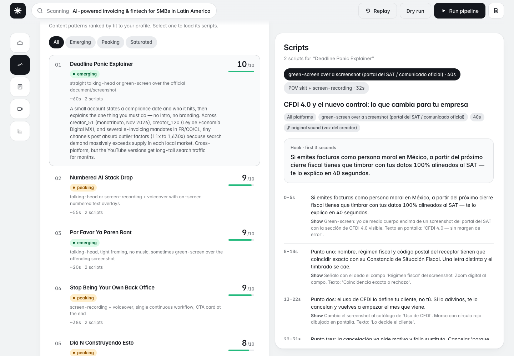

# trend-detector

[](LICENSE)
[](https://apify.com/store)

Find what short-form video content is getting reach in **your industry** right now, then get ready-to-shoot scripts that ride those trends in **your voice**.



**How it works**

1. **Collect** — [Apify](https://apify.com) Actors scrape TikTok, YouTube and Instagram Reels for your keywords (every run is spend-capped).
2. **Score & cluster** — each video is scored on velocity, engagement and **outlier factor** (views ÷ followers). A video that escaped its creator's own audience means the *format* is working, not the creator — and formats are what you can copy.
3. **Name the trends** — Claude reads the evidence and names 3–8 content patterns, with momentum (`emerging` / `peaking` / `saturated`) and a fit score for your profile.
4. **Write scripts** — Claude writes scripts for the best-fitting trends: hook, timestamped beats (say / show), CTA, caption, hashtags.

---

## Contents

- [Step 1 — Install and watch the demo (no API keys)](#step-1--install-and-watch-the-demo-no-api-keys)
- [Step 2 — Get your two API keys](#step-2--get-your-two-api-keys)
- [Step 3 — Describe yourself in `config/profile.json`](#step-3--describe-yourself-in-configprofilejson)
- [Step 4 — Run it](#step-4--run-it)
- [Step 5 — Read the results](#step-5--read-the-results)
- [What it costs](#what-it-costs)
- [Troubleshooting](#troubleshooting)
- [Command reference](#command-reference) · [Project layout](#project-layout) · [Responsible use](#responsible-use)

---

## Step 1 — Install and watch the demo (no API keys)

You need **[Node.js 22 or newer](https://nodejs.org)** (`node --version` to check).

```bash
git clone https://github.com/scarranca/socialmediatrenddetector.git
cd socialmediatrenddetector
npm install
npm run ui
```

Open **<http://localhost:4173/test>**.

You'll see a recorded real run replayed in 30 seconds — Apify Actors collecting videos, scoring, Claude naming trends and writing scripts — and then the page scrolls to the results. Nothing is spent; it's a recording bundled with the repo (creators anonymized).



The plain dashboard is at <http://localhost:4173>. Until you do your own run it shows the bundled demo results (the pill in the top right says **Demo data**).

## Step 2 — Get your two API keys

| Key | Where to get it | Cost |
|---|---|---|
| `APIFY_TOKEN` | Sign up at [apify.com](https://apify.com) (no card needed) → [Settings → API & Integrations](https://console.apify.com/settings/integrations) → copy the **Personal API token** | Free plan includes $5/month; a default run uses ≈ $0.50 |
| `ANTHROPIC_API_KEY` | [console.anthropic.com](https://console.anthropic.com) → [API keys](https://console.anthropic.com/settings/keys) → **Create key** (needs credit on the account) | ≈ $1 per run with the default settings |

Put them in a `.env` file:

```bash
cp .env.example .env
```

```ini
# .env
APIFY_TOKEN=apify_api_...
ANTHROPIC_API_KEY=sk-ant-...
APIFY_MAX_SPEND_USD=1.50     # optional hard cap per run; this is the default
```

`.env` is gitignored. Never commit it or paste it into an issue.

## Step 3 — Describe yourself in `config/profile.json`

```bash
cp config/profile.example.json config/profile.json
```

Open `config/profile.json` and edit it. This file is gitignored — it's yours. Two groups of fields matter:

**What gets searched** — be specific; these are typed into TikTok/YouTube search as-is.

| Field | What to put | Example |
|---|---|---|
| `keywords` | 3–6 search phrases your audience would actually type. Mix your language and English if your niche does. | `["facturacion electronica", "ai for small business"]` |
| `hashtags` | 3–6 hashtags **without** `#` (TikTok only) | `["fintech", "pymes"]` |
| `competitorInstagramProfiles` | Instagram usernames to watch. Leave `[]` to skip Instagram — its Actor scrapes by profile, not by keyword. | `["somebrand", "somecreator"]` |
| `platforms` | Which sources to run | `["tiktok", "youtube", "instagram"]` |
| `collection.resultsPerQuery` | Videos per keyword/hashtag. Raises cost linearly. | `20` |
| `collection.lookbackDays` | How recent. `30` is a good default; use `7` for fast-moving niches. | `30` |
| `collection.minViews` | Noise filter. Lower it (e.g. `1000`) for small or non-English niches. | `2000` |

**How the scripts are written** — write these like you'd brief a human scriptwriter.

| Field | What to put |
|---|---|
| `name`, `handle` | You |
| `industry` | One line: what you do and for whom |
| `language` | Language the scripts are written in, e.g. `en`, `es-MX`, `pt-BR` |
| `audience` | Who watches you and what they struggle with |
| `positioning` | What makes you different; how you show up on camera |
| `tone` | Voice, e.g. "direct, warm, no corporate jargon" |
| `offer` | What the call-to-action should point to (free trial, newsletter, booking link…) |
| `avoid` | Things you won't do: topics, claims, formats |
| `formats` | Formats you can realistically shoot, e.g. `"talking-head"`, `"screen-recording + voiceover"` |
| `targetDurationSeconds` | `[min, max]` length of your videos |

## Step 4 — Run it

**From the dashboard (recommended):**

```bash
npm run ui
```

Open <http://localhost:4173> and press **Run pipeline**. You'll watch every stage live. A run takes **5–8 minutes** (most of it is Apify scraping and Claude thinking).

**Or from the terminal:**

```bash
npm run run
```

Want to try the flow before spending Apify credit? Press **Dry run** in the dashboard (or `npm run sample`). It uses synthetic videos from `fixtures/` but still calls Claude, and it writes to `data/sample/` so it never overwrites a real run.

## Step 5 — Read the results

In the dashboard:



- **Trends** (left) are ranked by how well they fit *your* profile. The pill shows momentum: ride `emerging`, move fast on `peaking`, skip `saturated`.
- Click a trend to load its **Scripts** (right): the exact hook, what to say and show second by second, the CTA, and a caption with a **Copy** button. Under each script is the **evidence** — the videos the trend was derived from.
- **Top videos** shows the raw sample. The **Outlier** column is the one to watch: `26×` means a video got 26 times more views than its creator has followers.
- **Signals** lists the hashtags, sounds and queries with the most reach.
- **Replay** re-watches your last run at demo speed. The document icon (top right) opens the full markdown report, also saved to `output/report-<date>.md`.

Not happy with the trends? The usual fix is the **keywords**: make them more specific, add your language, then run again.

---

## What it costs

Defaults: 4 keywords + 4 hashtags × 20 results.

| Source | Actor | Price | Typical run |
|---|---|---|---|
| TikTok | [`clockworks/tiktok-scraper`](https://apify.com/clockworks/tiktok-scraper) | from $1.70 / 1k results | ~160 results ≈ $0.30 |
| YouTube (videos < 4 min, top by views in the window) | [`streamers/youtube-scraper`](https://apify.com/streamers/youtube-scraper) | from $2.40 / 1k videos | ~80 results ≈ $0.20 |
| Instagram Reels | [`apify/instagram-reel-scraper`](https://apify.com/apify/instagram-reel-scraper) | $2.60 / 1k reels (free plan) | $0 unless you list profiles |
| Claude (`claude-opus-5`) | 1 call to name trends + 1 call per scripted trend | | ≈ $1 |

Every Actor run gets a hard `maxTotalChargeUsd` cap: `APIFY_MAX_SPEND_USD` (default **$1.50**) split across the platforms that run. To spend less: lower `resultsPerQuery`, remove a platform, or pass `--trends 2 --per-trend 1`.

## Troubleshooting

| Problem | Fix |
|---|---|
| `Error: listen EADDRINUSE :::4173` | Another `npm run ui` is already running. The server moves to the next free port and prints which; to free the port: `lsof -ti :4173 \| xargs kill` |
| `Missing APIFY_TOKEN` / `Missing ANTHROPIC_API_KEY` | `.env` is missing or the value is blank. Re-check [Step 2](#step-2--get-your-two-api-keys). Run commands from the project root. |
| `No videos to analyze`, or very few videos kept | Your filters are too tight for the niche. Lower `collection.minViews`, raise `lookbackDays`, or broaden `keywords`. The log line `Kept N videos (dropped …)` tells you which filter dropped them. |
| A platform shows **failed** in the live view | The run continues with the other platforms. Open the run link printed in the log (`https://console.apify.com/actors/runs/…`) to see the Actor's own error. Usually: out of Apify credit, or the Actor is temporarily blocked. |
| YouTube returns 0 items | YouTube search can't combine every filter. This project searches videos < 4 min sorted by views; if your keywords are very narrow, try broader ones. |
| Claude call fails with 401 / 429 / credit errors | 401: wrong key. 429: rate limit — wait and re-run `npm run analyze` (it reuses the collected videos, no new Apify spend). Credit: add funds in the Anthropic console. |
| Dashboard still shows **Demo data** after a run | The run didn't finish. Check the log in the live view; `data/videos.json` must exist. |
| Scripts are in the wrong language | Set `language` in `config/profile.json` (e.g. `es-MX`) and run `npm run scripts` — it reuses the existing trends. |

Re-running a single stage is cheap: `npm run analyze` and `npm run scripts` reuse `data/videos.json`, so you only pay Apify once while you tune your profile.

## Command reference

```bash
npm run ui          # dashboard → http://localhost:4173   (/test auto-plays the recorded demo)
npm run run         # full pipeline: collect → analyze → scripts
npm run collect     # Apify only            → data/videos.json
npm run analyze     # scoring + trends      → data/trends.json
npm run scripts     # scripts + report      → data/scripts.json, output/report-<date>.md
npm run sample      # dry run on fixtures   → data/sample/ (no Apify spend)
npm test            # unit tests (no API keys needed)
npm run typecheck
```

Flags go after `--`, e.g. `npm run run -- --trends 6 --per-trend 3`:

| Flag | Default | Meaning |
|---|---|---|
| `--trends <n>` | `4` | How many top-fit trends get scripts |
| `--per-trend <n>` | `2` | Scripts per trend |
| `--max-spend <usd>` | `1.50` | Apify cap for this run |
| `--profile <path>` | `config/profile.json` | Use another profile (handy for several brands) |
| `--sample` | | Use fixture videos instead of Apify |

## Project layout

```
config/profile.example.json   template — copy to config/profile.json (gitignored) and edit
src/collect.ts                Apify Actor runs + normalization into one Video shape
src/analyze.ts                scoring, clustering, evidence selection (pure functions)
src/llm.ts                    Claude: trend synthesis + script writing (structured outputs)
src/report.ts                 markdown report
src/index.ts                  CLI
src/events.ts                 structured pipeline events for the live UI
src/serve.ts                  dashboard server: static UI, /api/data, /api/run, SSE logs, replay
ui/                           dashboard — vanilla HTML/CSS/JS, no build step
test/                         node:test suites for scoring, clustering and Actor normalizers
fixtures/                     synthetic sample videos (--sample) + an anonymized recorded run (/test)
data/, output/                your runs and reports (gitignored)
```

The pipeline emits structured events (`src/events.ts`, enabled with `TD_EVENTS=1`) that the server fans out over Server-Sent Events (`/api/logs`) and records to `data/last-run-events.json` — that's what **Replay** plays back.

## Responsible use

- This tool reads **public** post metadata (captions, counts, handles) through third-party Apify Actors. You are responsible for complying with each platform's terms and with the laws that apply to you, including privacy law if you store data about people.
- It's built for **format research** — learning which structures work — not for copying anyone's content. The script prompts forbid reproducing evidence captions verbatim; keep it that way.
- The bundled demo (`fixtures/demo-data/`, `fixtures/demo-run-events.json`) comes from a real run, with creators replaced by pseudonyms (`creator_01`…), video IDs and links removed, and mentions and brand names scrubbed. `fixtures/sample-videos.json` is fully synthetic. Your own runs stay in `data/`, which is gitignored — don't commit it.
- The dashboard server has no authentication and can spend your API credit. Keep it on localhost. See [SECURITY.md](SECURITY.md).

## Contributing

Issues and PRs welcome — see [CONTRIBUTING.md](CONTRIBUTING.md). `npm test` needs no API keys.

## Acknowledgements

Built on [Apify](https://apify.com) Actors — [`clockworks/tiktok-scraper`](https://apify.com/clockworks/tiktok-scraper), [`streamers/youtube-scraper`](https://apify.com/streamers/youtube-scraper), [`apify/instagram-reel-scraper`](https://apify.com/apify/instagram-reel-scraper) — and [Claude](https://www.anthropic.com/claude) structured outputs.

## License

[MIT](LICENSE)
